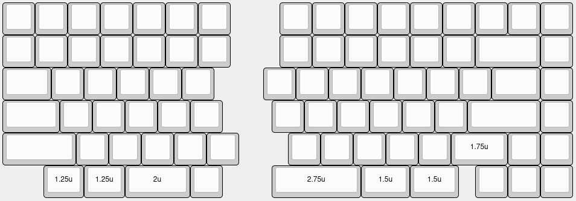

# DeltaSplit75-Case-files

Original case files from xyxjj, with the addition of DXF files for a "full hand" version with integrated wrist rest.

**Full hand case files are intended to be used with the following layout:**  

**Intended layer configuration:**
- 1x 3mm acrylic top layer
- 1x 3mm acrylic second from top layer
- 1x 1.5mm metal plate
- 1x 4mm foam layer (optional, for between plate and PCB)
- 4x 3mm acrylic middle layers
- 1x 3mm acrylic second from bottom layer
- 1x 3mm acrylic bottom layer

**Additional assembly hardware:**
- 22x 1" #4 machine screws
- 22x #4 machine screw nuts

**TODO:**
- Take out notch in middle layers to allow for Proton C/Pro Micro
- ~~Add holes for more locations for aluminum feet in bottom layer~~
- ~~Add second from bottom layer with holes to accommodate aluminum feet~~
- Take out notch in middle layers to allow for TRRS jacks

**Original contents:**  
> Files available in dxf and dwg, dimensions in mm
>
> Known Working configuration  
> 2x3mm acryic top bezel  
> 1x1.5mm aluminium plate  
> 5x3mm acrylic middle layers  
> 1x3mm acrylic bottom layer

